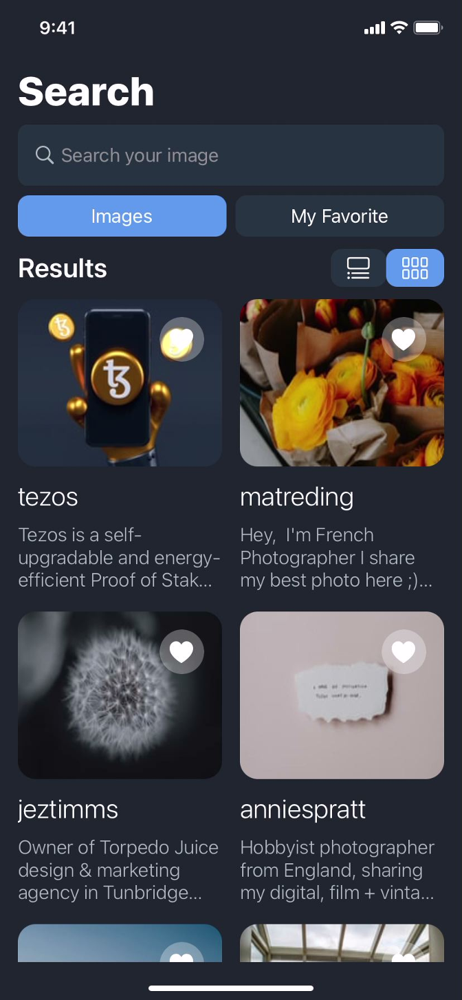
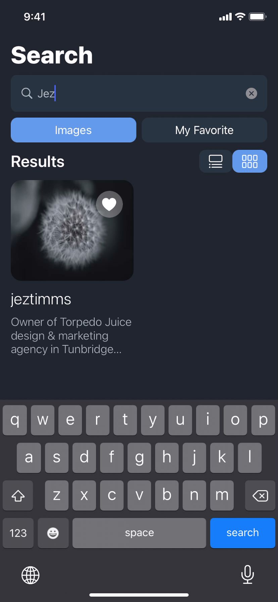
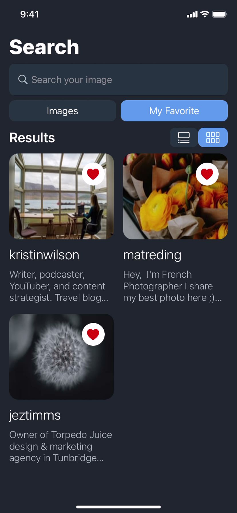
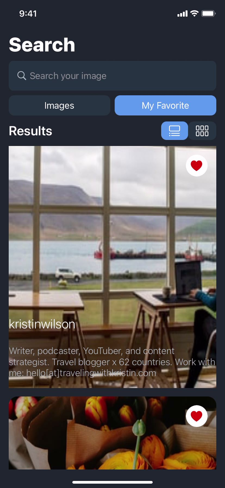

#  Motory Task

This is my version of the assignment i was given

it has all basic requirments as well as all optional functions.

#  Features:

Followed given design

Only used libraries for api & image caching

Search for image

Image caching

Listview and Grid view switcher

Image Viewer with zoom capability

Liked / Favorites Folder

<h2>Design</h2> 
  
  <br/ >
    <br/ >
<h2>GridView</h2>
  
    <br/ >
    <br/ >
        <h2>Search</h2>
  
    <br/ >
    <br/ >
        <h2>Favorite</h2>
  
    <br/ >
    <br/ >
        <h2>Zoom</h2>
  
    <br/ >
    <br/ >

